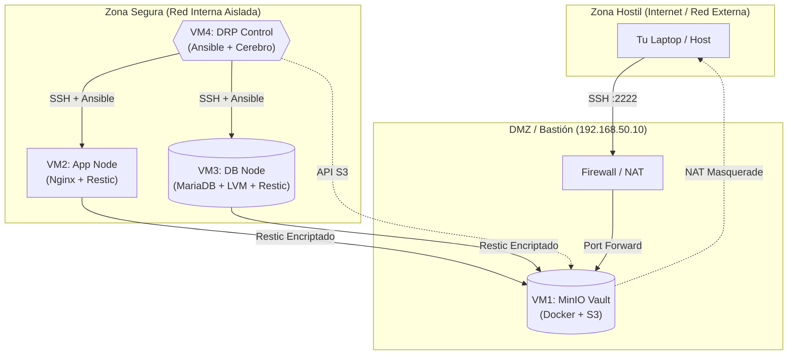

# Plan de Resiliencia
Para este proyecto se usara 4 maquinas:
la direccion ip interna que usaremos sera 192.168.50.x

Restic para el motor.

Systemd para el cronómetro.

LVM para la integridad de los datos.

Ansible para la resurrección del sistema.


#  Fase : Arquitectura de Hierro

##  Especificaciones de Hardware
- **Host Global**: mínimo 8 GB RAM libres.  
- **Distribución de VMs:**

| VM | Hostname | RAM | CPU | Disco OS | Disco Datos | Red |
|----|----------|-----|-----|----------|-------------|-----|
| VM1 | `minio-vault` | 2048 MB | 2 | 25 GB | 20 GB (Backups) | NAT + Red Interna |
| VM2 | `app-node` | 1024 MB | 1 | 25 GB | - | Red Interna |
| VM3 | `db-node` | 1536 MB | 1 | 25 GB | 10 GB (LVM) | Red Interna |
| VM4 | `drp-control` | 1024 MB | 1 | 25 GB | - | Red Interna |

**Notas clave:**
- VM1 = Bastion Host (único acceso a internet).  
- VM3 = disco extra obligatorio para snapshots LVM.  
- Red Interna = aislada, solo VM1 conecta al exterior.
- para ver los discos en una vm el comando es:
  ```bash
  lsblk
  ```

## En todas las máquinas

```bash
sudo apt update && sudo apt upgrade -y
```
> Para actualizar todos los paquetes
```bash
sudo apt install net-tools curl git htop nano -y
```
> Sirve para instalar herramientas basicas que vamos a usar
---
## Para configurar las ip staticas
### VM1 - minio-vault
```bash
sudo nano /etc/netplan/50-cloud-init.yaml
```
>Esta es la configuracion de red
dentro de la configuracion de red
```bash
network:
  version: 2
  renderer: networkd
  ethernets:
    enp0s3:
      dhcp4: true
    enp0s8:
      dhcp4: no
      addresses:
        - 192.168.50.10/24
```
aplicar cambios
```bash
sudo netplan apply
```
Para activar reenvío de paquetes en el kernel
```bash
echo "net.ipv4.ip_forward=1" | sudo tee -a /etc/sysctl.conf
sudo sysctl -p
```
Instalar iptables-persistent para guardar las reglas
```bash
sudo apt install iptables-persistent -y
```
Es la regla NAT para que las demas maquinas tengan acceso a internet
```bash
sudo iptables -t nat -A POSTROUTING -o enp0s3 -j MASQUERADE
sudo netfilter-persistent save
```
### VM2-app-node
abrir la configuracion de red
```bash
sudo nano /etc/netplan/50-cloud-init.yaml
```
alli dentro
```bash
network:
  version: 2
  renderer: networkd
  ethernets:
    enp0s3:
      dhcp4: no
      addresses:
        - 192.168.50.20/24
      routes:
        - to: default
          via: 192.168.50.10
      nameservers:
        addresses: [8.8.8.8, 1.1.1.1]
```
aplicar cambios
```bash
sudo netplan apply
```
### VM3-db-node
abrir la configuracion de red
```bash
sudo nano /etc/netplan/50-cloud-init.yaml
```
alli dentro
```bash
network:
  version: 2
  renderer: networkd
  ethernets:
    enp0s3:
      dhcp4: no
      addresses:
        - 192.168.50.30/24
      routes:
        - to: default
          via: 192.168.50.10
      nameservers:
        addresses: [8.8.8.8, 1.1.1.1]
```
aplicar cambios
```bash
sudo netplan apply
```
### VM4-drp-control
abrir la configuracion de red
```bash
sudo nano /etc/netplan/50-cloud-init.yaml
```
ahi dentro
```bash
network:
  version: 2
  renderer: networkd
  ethernets:
    enp0s3:
      dhcp4: no
      addresses:
        - 192.168.50.40/24
      routes:
        - to: default
          via: 192.168.50.10
      nameservers:
        addresses: [8.8.8.8, 1.1.1.1]
```
aplicar cambios
```bash
sudo netplan apply
```
> # PARA PROBAR QUE TODO ESTA BIEN HASTA ESTE PUNTO CADA MAQUINA DEBE PODER HACER PING A GOOGLE.COM
## Generar claves SSH
Para que Ansible pueda comunicarse a las demas maquinas de forma automatica sin intervención humana entre el orquestador (Ansible) y los nodos operativos. 
### VM4-drp-control
Esto sirve para crear un par de llaves criptográficas una publica y otra privada
la encriptacion ed25519 son llaves pequeñas, por eso son mas seguras y rapidas
```bash
ssh-keygen -t ed25519 -C "ansible-control" -f ~/.ssh/id_ed25519 -N ""
```
Se debe copiar las llaves publicas a los demas servidores para poder entrar a ellas sin usar contrasenia, en este ejemplo todas mis maquinas tienen el usuario "jhoel", pero si se tiene otro usuario se las debe poner el nombre del usuario en vez de jhoel segun la maquina a la que corresponda

Copiar llave a VM1 (MinIO Vault)
```bash
ssh-copy-id -i ~/.ssh/id_ed25519.pub jhoel@192.168.50.10
```
Copiar llave a VM2 (App Node)
```bash
ssh-copy-id -i ~/.ssh/id_ed25519.pub jhoel@192.168.50.20
```
Copiar llave a VM3 (DB Node)
```bash
ssh-copy-id -i ~/.ssh/id_ed25519.pub jhoel@192.168.50.30
```
> Para probar que funciona, el vm4 debe intentar acceder a cualquier otra maquina
> si le pide contrasenia entonces algo fallo
> si es que no le pide la contrasenia ni le deja entrar algo fallo
> si es que no le pide la contrasenia pero si deja entrar entonces esta bien -> autenticación exitosa mediante clave pública


## Instalacion de otras Herramientas
### VM3-db-node
Verificamos que el disco secundario destinado a los snapshots esté disponible:
```bash
lsblk
```
> Debe aparecerte el disco de 10 gb, comunmente aparece como sdb
Para instalar un gestor de volumenes logicos (lvm2)
que nos permitirá congelar el tiempo (snapshots) sin detener la base de datos
```bash
sudo apt update && sudo apt install lvm2 -y
```
## VM1 - minio-vault
Usaremos Docker para levantar MinIO, asi que instalamos docker
```bash
sudo apt update && sudo apt install docker.io -y
```
> no es el docker oficial si no la version que es mantenido por ubuntu.

Agregamos al usuario actual al grupo docker para administrar contenedores sin invocar sudo constantemente
```bash
sudo usermod -aG docker $USER
```
> Este cambio no tiene efecto inmediato. Debes cerrar sesión (exit) y volver a entrar, o ejecutar newgrp docker para refrescar tus credenciales de grupo. Si ignoras esto, Docker te rechazará.

## VM4-drp-control
Instalar ansible para orquestar el DRP es decir es el cerebro de la operación. Ansible será el encargado de ejecutar la resurrección del sistema
```bash
sudo apt update && sudo apt install ansible -y
```
## Despliegue de MinIO
## VM1-minio-vault
crearemos este directorio que servirá como punto de montaje persistente
si el contenedor de MinIO muere o se reinicia, los datos dentro de él desaparecen. Al mapear esto al host, aseguramos que los backups sobrevivan a la destrucción del contenedor.
```bash
sudo mkdir -p /mnt/data
```
para darle permisos a minio sobre esa carpeta, MinIO corre por seguridad con el UID 1001, no como root. Si no haces esto, el contenedor arranca, intenta escribir en /data y muere con "Permission Denied" es decir por permisos denegados.
```bash
sudo chown -R 1001:1001 /mnt/data
```
pegar este bloque completo en uno, en este caso usaremos de contrasenia SuperSecretKey123 pero en un entorno real debe ser una contrasenia mas dificil
```bash
docker run -dt \
  -p 9000:9000 -p 9001:9001 \
  --name minio \
  --restart always \
  -v /mnt/data:/data \
  -e "MINIO_ROOT_USER=admin" \
  -e "MINIO_ROOT_PASSWORD=SuperSecretKey123" \
  minio/minio server /data --console-address ":9001"
```
> La bandera --restart always es crítica; si el servidor se reinicia por un fallo eléctrico o error, el servicio de almacenamiento vuelve a levantar automáticamente sin intervención humana.

Para verificar Debería ver algo como "API: http://172.17.0.2:9000"
```bash
docker logs minio
```
## VM4-drp-control
Para descargar el ejecutable de minio cliente y lo guarda en una carpeta
```bash
curl https://dl.min.io/client/mc/release/linux-amd64/mc \
  --create-dirs \
  -o $HOME/minio-binaries/mc
```
Le damos permisos de ejecucion. sin esto la maquina pensara que solo un archivo de texto
```bash
chmod +x $HOME/minio-binaries/mc
```
para que cuando mc este escribiendo, se busque también en esta carpeta
```bash
export PATH=$PATH:$HOME/minio-binaries/
```
Guarda esa configuración para siempre, para que no tengas que hacerlo cada vez que inicies sesión
```bash
echo 'export PATH=$PATH:$HOME/minio-binaries/' >> ~/.bashrc
```
Para recargar el perfil
```bash
source ~/.bashrc
```
con esto unimos la vm4 con la vm1
mi-boveda asi le llamaremos a la vm1 
```bash
mc alias set mi-boveda http://192.168.50.10:9000 admin SuperSecretKey123
```
> te deberia aparecer un texto que diga Added `mi-boveda` successfully
para crear un bucket es decir un contenedor logico dentro de minio llamado backup-repo
aqui es donde restic guardara los datos cifrados
```bash
mc mb mi-boveda/backup-repo
```
deberia aparecer la fecha, tamanio y backup-repo/
```bash
mc ls mi-boveda
```
## VM2 - App Node
Para actualizar repositorios e intarlar restic
```bash
sudo apt update && sudo apt install restic -y
```
Para inicializar el repositorio
```bash
export AWS_ACCESS_KEY_ID="admin"
```
```bash
export AWS_SECRET_ACCESS_KEY="SuperSecretKey123"
```
```bash
export RESTIC_REPOSITORY="s3:http://192.168.50.10:9000/backup-repo"
```
```bash
export RESTIC_PASSWORD="EncryptionPasswordDoNotLose"
```
Para iniciar restic
```bash
restic init
```
> te deberia salir algo con "created restic repository" continuando por un codigo de hash ejemplo 63832b86e5
para hacer una prueba, generaremos un archivo basura
```bash
sudo mkdir -p /var/www/html
```
```bash
echo "Hola Mundo Resiliente. Si lees esto, la red no ha colapsado." | sudo tee /var/www/html/index.html
```
para backup
```hash
restic backup /var/www/html --tag "app-deploy-v1"
```
> si te sale algo como snapshot <ID> saved donde ID es un codigo entonces esta bien
## VM3-db-node
Para actualizar repositorios e instalar restic
```hash
sudo apt update && sudo apt install restic -y
```
### Importante no fallar
Inicializar el disco físico
```hash
sudo pvcreate /dev/sdb
```
Crear el Grupo de Volumen
```hash
sudo vgcreate vg_datos /dev/sdb
```
Crear el Volumen Lógico
OJO: Asignamos 6GB. Dejamos 4GB libres para los snapshots
Un snapshot necesita espacio libre en el VG para crecer
```bash
sudo lvcreate -L 6G -n lv_mysql vg_datos
```
Formatear y Montar
```bash
sudo mkfs.ext4 /dev/vg_datos/lv_mysql
```
```bash
sudo mkdir -p /mnt/mysql-data
```
```bash
sudo mount /dev/vg_datos/lv_mysql /mnt/mysql-data
```
Sembraremos datos falsos como simulación de BD
```bash
sudo mkdir -p /mnt/mysql-data/db_files
```
```bash
sudo touch /mnt/mysql-data/db_files/users.ibd
```
```bash
echo "DB_PASSWORD=SuperSecretKey" | sudo tee /mnt/mysql-data/db_files/config.php
```
Crearemos un script para Congelar (Snapshot) -> Copiar (Backup) -> Descongelar (Remove)
```bash
sudo nano /usr/local/bin/backup_db.sh
```
Dentro pondremos el script:
```bash
#!/bin/bash
set -e  # Abortar si cualquier comando falla.

# --- Configuración del Búnker ---
export AWS_ACCESS_KEY_ID="admin"
export AWS_SECRET_ACCESS_KEY="SuperSecretKey123"
# Apunta al MinIO (VM1)
export RESTIC_REPOSITORY="s3:http://192.168.50.10:9000/backup-repo"
export RESTIC_PASSWORD="EncryptionPasswordDoNotLose"

# Variables LVM
VG_NAME="vg_datos"
LV_NAME="lv_mysql"
SNAP_NAME="snap_backup"
MOUNT_POINT="/mnt/snapshot_db"

echo "[1] Creando Snapshot (Congelando estado en el tiempo)..."
# Creamos un snapshot de 1GB. 
# Si la base de datos escribe más de 1GB de cambios durante el backup, el snapshot colapsa.
lvcreate -L 1G -s -n $SNAP_NAME /dev/$VG_NAME/$LV_NAME

echo "[2] Montando Snapshot (Solo lectura)..."
mkdir -p $MOUNT_POINT
mount -o ro /dev/$VG_NAME/$SNAP_NAME $MOUNT_POINT

echo "[3] Enviando a la Bóveda..."
# Hacemos backup del PUNTO DE MONTAJE, no del disco vivo.
restic backup $MOUNT_POINT --tag "db-consistent-snap"

echo "[4] Limpieza de la escena del crimen..."
umount $MOUNT_POINT
lvremove -y /dev/$VG_NAME/$SNAP_NAME

echo "Operación completada. La base de datos ni se enteró."
```
> Guarda (Ctrl+O, Enter, Ctrl+X)
para darle los permisos
```bash
sudo chmod +x /usr/local/bin/backup_db.sh
```
Inicializar el repo desde VM3 también
```bash
export AWS_ACCESS_KEY_ID="admin"
```
```bash
export AWS_SECRET_ACCESS_KEY="SuperSecretKey123"
```
```bash
export RESTIC_REPOSITORY="s3:http://192.168.50.10:9000/backup-repo"
```
```bash
export RESTIC_PASSWORD="EncryptionPasswordDoNotLose"
```
```bash
restic init || echo "Repo detectado."
```
> Este ultimo dara error si ya existe, en ese caso solo lo ignoras
para ejecutar el script
```bash
sudo /usr/local/bin/backup_db.sh
```
## VM4-Admin-Node
para ver que los bloques encriptados aterrizaron en la Bóveda
```bash
mc ls mi-boveda/backup-repo/data/
```
> deberia salir algo como esto o parecido en tanto a la estructura:
> [2025-11-19 15:46:06 UTC]     0B 34/
> [2025-11-19 15:46:06 UTC]     0B 8a/
> [2025-11-19 15:46:06 UTC]     0B 99/
> [2025-11-19 15:46:06 UTC]     0B f4/

# Fase 3: El Cronómetro, Automatización con Systemd
reemplazaremos cron con Systemd Timers por que este maneja dependencias, reintentos y deja logs binarios (journalctl) que podemos auditar.
## VM2-App-Node
Crea el archivo del script para el backup
```bash
sudo nano /usr/local/bin/backup_app.sh
```
dentro del script:
```bash
#!/bin/bash
set -e

# Credenciales
export AWS_ACCESS_KEY_ID="admin"
export AWS_SECRET_ACCESS_KEY="SuperSecretKey123"
export RESTIC_REPOSITORY="s3:http://192.168.50.10:9000/backup-repo"
export RESTIC_PASSWORD="EncryptionPasswordDoNotLose"

# 1. El Backup
echo "Iniciando backup de App..."
restic backup /var/www/html --tag "app-auto"

# 2. La Limpieza (Política de Retención)
echo "Aplicando política de retención..."
restic forget --keep-daily 7 --keep-weekly 4 --prune
```
> Guarda (Ctrl+O, Enter) y sal (Ctrl+X)
para que tenga permisos de ejecucion
```bash
sudo chmod +x /usr/local/bin/backup_app.sh
```
Esto le dira a systemd qué ejecutar
```bash
sudo nano /etc/systemd/system/backup-app.service
```
y dentro:
```bash
[Unit]
Description=Restic Backup para Aplicacion
After=network-online.target

[Service]
Type=oneshot
ExecStart=/usr/local/bin/backup_app.sh
User=root
```
Le decimos a systemd cuándo disparar el servicio
```bash
sudo nano /etc/systemd/system/backup-app.timer
```
dentro:
```bash
[Unit]
Description=Ejecuta backup de App cada minuto (Demo)

[Timer]
OnCalendar=*:*
Persistent=true

[Install]
WantedBy=timers.target
```
> OnCalendar=*:*:
> El primer * es la Hora (todas las horas).
> El : es el separador.
> El segundo * es el Minuto (todos los minutos).

Systemd calcula el siguiente punto en el tiempo que coincida con ese patrón
Recargamos el cerebro de systemd y encendemos el timer
```bash
sudo systemctl daemon-reload
```
```bash
sudo systemctl enable --now backup-app.timer
```
para verificar
```bash
systemctl list-timers
```
> deberia aparecer backup-app.timer y la columna left en el que debe de estar menos de 1 minuto
## VM3-db-node
```bash
ls -l /usr/local/bin/backup_db.sh
```
> Si no sale verde o con x, dale sudo chmod +x /usr/local/bin/backup_db.sh
Crear el Servicio (.service)
```bash
sudo nano /etc/systemd/system/backup-db.service
```
dentro:
```bash
[Unit]
Description=Restic Backup para MariaDB (LVM Snapshot)
After=network-online.target

[Service]
Type=oneshot
ExecStart=/usr/local/bin/backup_db.sh
User=root
```
Crear el Timer (.timer)
```bash
sudo nano /etc/systemd/system/backup-db.timer
```
dentro:
```bash
[Unit]
Description=Ejecuta backup de DB cada minuto (Demo)

[Timer]
OnCalendar=*:*
Persistent=true

[Install]
WantedBy=timers.target
```
Para activar y verificar:
```bash
sudo systemctl daemon-reload
```
```bash
sudo systemctl enable --now backup-db.timer
```
para verificar:
```bash
systemctl list-timers
```
> el primer left debe estar en menos o igual de un minuto, si no lo esta, prueba de nuevo el mismo comando, a veces tarda en actualizarse
> y si aun no sigue, revisa las configuraciones
para verificar los logs("Operación completada" y "snapshot saved"):
```bash
journalctl -u backup-db.service -n 20 --no-pager
```
## VM2 - App Node
para verificar los logs
```bash
journalctl -u backup-app.service -n 20 --no-pager
```
## VM4-drp-control
para ver los nuevo snapshot que se deberian crear cada minuto:
```bash
mc ls -r mi-boveda/backup-repo/snapshots/
```
> El ciclo de vida de tu minuto:

> 19:29: Se crea el Snapshot A. Restic ve que es el último de hoy. Se lo queda.

> 19:30: Se crea el Snapshot B.

> 19:30 (medio segundo después): Se ejecuta el forget. Restic ve que tiene A (19:29) y B (19:30) para el mismo día. La política dice "guarda 1 por día". Restic borra A y se queda con B.

# Fase 4: DRP con Ansible
## VM4-drp-control
para crear y entrar al directorio para la logica de recuperacion
```bash
mkdir -p ~/ansible-drp && cd ~/ansible-drp
```
para el inventario o victimas de Ansible
```bash
nano hosts
```
dentro:
```bash
[app_servers]
192.168.50.20 ansible_user=jhoel

[db_servers]
192.168.50.30 ansible_user=jhoel
```
> Guarda (Ctrl+O, Enter) y sal (Ctrl+X).
para ver que tenga coneccion con el inventario de ansible
```bash
ansible all -i hosts -m ping
```
> deveria apaarecer "ping": "pong" y SUCCESS si esta bien
aun dentro de la VM4-drp-control y dentro de ~/ansible-drp
```bash
nano restore_app.yml
```
ahi dentro de restore_app va este codigo yaml:
```bash
---
- name: DRP - Restauración de Emergencia Aplicación
  hosts: app_servers
  become: yes
  vars:
    restore_path: "/tmp/rescate_app"
    repo_url: "s3:http://192.168.50.10:9000/backup-repo"
    env_vars:
      AWS_ACCESS_KEY_ID: "admin"
      AWS_SECRET_ACCESS_KEY: "SuperSecretKey123"
      RESTIC_REPOSITORY: "{{ repo_url }}"
      RESTIC_PASSWORD: "EncryptionPasswordDoNotLose"

  tasks:
    - name: "[1] Asegurar que Restic esté instalado"
      apt:
        name: restic
        state: present
        update_cache: yes

    - name: "[2] Crear directorio de zona segura"
      file:
        path: "{{ restore_path }}"
        state: directory
        mode: '0755'

    - name: "[3] Ejecutar Restauración desde la Bóveda"
      shell: |
        export AWS_ACCESS_KEY_ID="{{ env_vars.AWS_ACCESS_KEY_ID }}"
        export AWS_SECRET_ACCESS_KEY="{{ env_vars.AWS_SECRET_ACCESS_KEY }}"
        export RESTIC_PASSWORD="{{ env_vars.RESTIC_PASSWORD }}"        
        restic -r {{ repo_url }} restore latest --tag "app-deploy-v1" --target {{ restore_path }}
      register: restore_out

    - name: "[4] Reporte de Operación"
      debug:
        msg: 
          - "Restauración Exitosa en: {{ restore_path }}"
          - "Log Restic: {{ restore_out.stdout }}"
```
> Guarda (Ctrl+O, Enter) y sal (Ctrl+X)

# Para probar si funciona:
## VM2 - App Node
Para probar que funciona
verificamos que tenemos aqui
```bash
sudo cat /var/www/html/index.html
```
borramos index.html
```bash
sudo rm -rf /var/www/html/index.html
```
verificamos que se haya borrado
```bash
ls -l /var/www/html/
```
## VM4-drp-control aun en ~/ansible-drp 
para restaurar:

```bash
ansible-playbook -i hosts restore_app.yml -K
```

## VM2 - App Node
para verificar que volvio 
```bash
sudo cat /var/www/html/index.html
```
-----
# Lo de abajo aun no probado pero creo que si funciona xd
-----

# 🕰️ Manual de Restauración Quirúrgica (Por ID)

**Ubicación:** Todo esto se ejecuta desde la **VM4 (`drp-control`)**.
**Directorio de trabajo:** Asegúrate de estar dentro del búnker:

```bash
cd ~/ansible-drp
```

## 1\. El Catálogo de Tiempos (Listar Snapshots)

Para ver qué opciones de viaje en el tiempo tienes, consultamos directamente a la Bóveda (MinIO) usando el cliente `mc`.

**Comando:**

```bash
mc ls -r mi-boveda/backup-repo/snapshots/
```

**Traducción:**

  * `mc`: MinIO Client.
  * `ls -r`: Listar recursivamente.
  * `mi-boveda/...`: La ruta al bucket donde Restic guarda los metadatos de los snapshots.

**Lo que verás (Ejemplo):**

```text
[2025-11-19 15:12:33 UTC]   242B STANDARD dd90c8b5d82b7478c83d06099e03aae6ce69e58259f01186e02a016b9229b8c0
[2025-11-19 19:14:20 UTC]   367B STANDARD 3915ff940516a8e32b0f01dbce9a326703e1f5b91929a1fe5eca43c43c4c6d20
```

**Interpretación:** Los primeros 8 caracteres del nombre del archivo (ej. `dd90c8b5`) son el **Snapshot ID** corto. Esa es tu coordenada de destino.

-----

## 2\. La Modificación del Hechizo (Editar Playbook)

Necesitamos decirle a Ansible que deje de buscar etiquetas (`--tag`) y busque un ID específico.

Abre tu playbook:

```bash
nano restore_app.yml
```

Busca la sección `shell` dentro de la tarea **"[3] Ejecutar Restauración..."** y modifícala.

**ANTES (Modo Automático/Etiqueta):**

```yaml
    - name: "[3] Ejecutar Restauración desde la Bóveda"
      shell: |
        export AWS_ACCESS_KEY_ID="{{ env_vars.AWS_ACCESS_KEY_ID }}"
        export AWS_SECRET_ACCESS_KEY="{{ env_vars.AWS_SECRET_ACCESS_KEY }}"
        export RESTIC_PASSWORD="{{ env_vars.RESTIC_PASSWORD }}"        
        # Restaurar usando TAG
        restic -r {{ repo_url }} restore latest --tag "app-deploy-v1" --target {{ restore_path }}
      register: restore_out
```

**DESPUÉS (Modo Quirúrgico/ID):**
*Reemplaza `<ID_DEL_SNAPSHOT>` con el código que elegiste en el paso 1 (ej. `dd90c8b5`).*

```yaml
    - name: "[3] Ejecutar Restauración desde la Bóveda"
      shell: |
        export AWS_ACCESS_KEY_ID="{{ env_vars.AWS_ACCESS_KEY_ID }}"
        export AWS_SECRET_ACCESS_KEY="{{ env_vars.AWS_SECRET_ACCESS_KEY }}"
        export RESTIC_PASSWORD="{{ env_vars.RESTIC_PASSWORD }}"        
        # Restaurar usando ID ESPECÍFICO
        restic -r {{ repo_url }} restore dd90c8b5 --target {{ restore_path }}
      register: restore_out
```

> **Nota:** Al usar un ID, **borra** las banderas `latest` y `--tag`. Son incompatibles o redundantes cuando especificas el ID directo.

Guarda (`Ctrl+O`, `Enter`) y sal (`Ctrl+X`).

-----

## 3\. La Ejecución (El Botón Rojo)

Lanza el playbook modificado. Ansible pedirá tu contraseña `sudo` (la de `jhoel`).

**Comando:**

```bash
ansible-playbook -i hosts restore_app.yml -K
```

**Resultado esperado:**
Si todo sale bien, Ansible te mostrará un JSON al final confirmando que restauró los archivos desde ese ID específico hacia `/tmp/rescate_app`.

-----
